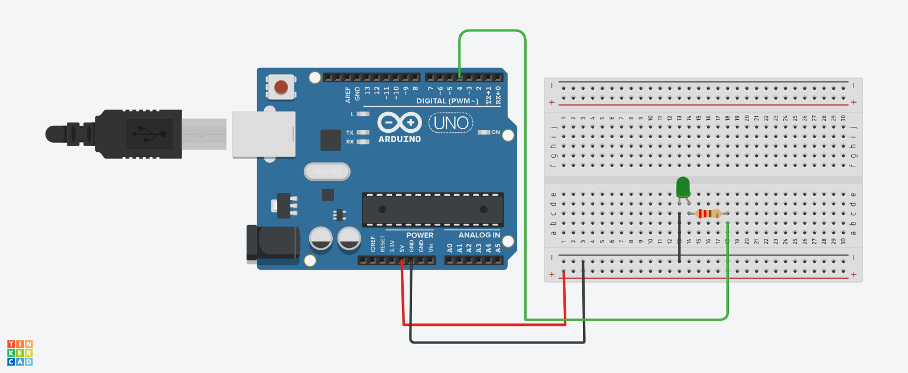

## Acender Led
Este projeto foi desenvolvido dentro do Tinkercad, na disciplina de Internet das Coisas (IOT), para criação de um protótipo com arduíno que simula um
led sendo aceso.

# Componentes Usados
- 1 Arduíno Uno
- 1 Protoboard
- 5 Jumpers m/m
- 1 led de 3.3 v
- 1 resistor 220 hms

# Montando o Circuíto

# Explicação do Código

variável para capturar a porta de conexão do led
int led = 4;

Método define o led como dispositivo de saída
void setup()
{
  pinMode(led,OUTPUT);
}
Função de execução de instruções infinitas/loop que dá o comando para acender o led, um pausa de 2 segundos
e apaga o led novamente com uma nova pauda de 2 segundos.
void loop()
{
  digitalWrite(led,HIGH);
  delay(2000);
  digitalWrite(led,LOW);
  delay(2000);
