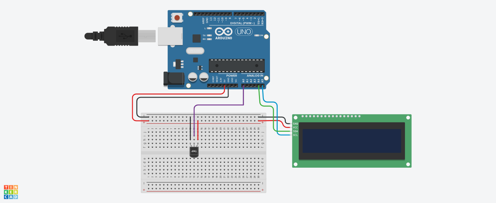

# Projeto Sensor de luminosidade

Este projeto foi desenvolvido dentro do Tinkercad, na disciplina de Internet das Coisas (IOT), para criação de um prototipo com arduíno que simule um sensor de 
luminosidade que transforma a luz ambiente em ondas que acendem ou apagam o led.

## Componentes Usados

- 1 Arduíno Uno
- 1 Protoboard
- 7 Jumpers m/m
- 1 led azul de 3.3 v
- 1 resistor 220 hms
- 1 resistor 10 KOhms
- 1 fotoresistor

## Momtagem do circuíto

## Explicação do Código

Criação da variável para o led
int led =3;
Criação da variável para o fotoresistor
int sensor_lumi = A0;
Variável para capturar a luminosidade do ambiente
int luz = 0;

Método para capturar os dados de entrada e enviar o sinal para acionar o led
void setup()
{
 pinMode(led,OUTPUT);
 
 pinMode(sensor_lumi,INPUT);
}
Método que captura o que o sensor leu no ambiente com o sensor conectado na porta analógica
e com o comando if/if/else acendendo o led na escala ou apagando na escala entre 1 a 1023 de 
instensidade de acordo com a intensidada de iluminação do ambiente
no if/else

void loop()
{
 
  if(luz<500){
    analogWrite(led,1023);
  }
  if(luz>500 & luz<900){
    analogWrite(led,500);
  }
  else{
    analogWrite(led,0);
  }
}
