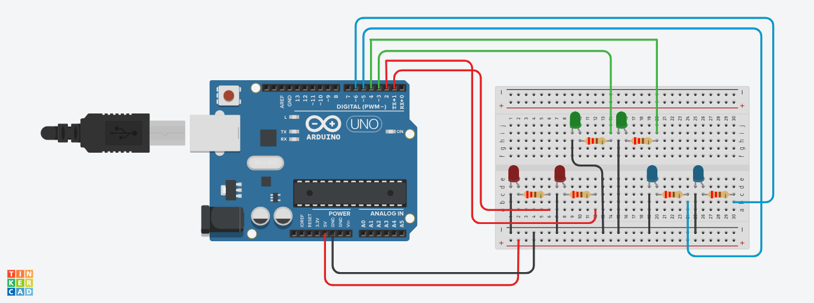

# Projeto LEDs Piscantes
Este projeto foi desenvolvido dentro do Tinkercad, na disciplina de Internet das Coisas (IOT), para criação de um 
protótipo com arduíno que simula leds seno acesos e piscando de acordo com uma sequência previamente definida.

## Componentes Usados
- 1 Arduíno Uno
- 1 Protoboard
- 14 Jumpers m/m
- 6 Leds 3.3 v
- 6 Resistores 220 hms

## Montando o Circúito

## Explicação do Código
Criação das variáveis usadas para identificar os pinos onde os LEDs estão conectados na placa Arduino. Cada número
atribuído a essas variáveis (1, 2, 3, 4, 5, 6) corresponde ao número de um pino físico do Arduino

int ledVermelho1 = 1;
int ledVermelho2 = 2;
int ledVerde1 = 3;
int ledVerde2 = 4;
int ledAzul1 = 5;
int ledAzul2 = 6;

Essa função é executada apenas uma vez, no início. Ela configura os pinos associados aos LEDs como saída, o que 
significa que o arduino irá enviar sinais elétricos para esses pinos, controlando os LEDs. É aqui que o arduino 
se prepara para interagir com os LEDs.

void setup() {
  pinMode(ledVermelho1, OUTPUT);
  pinMode(ledVermelho2, OUTPUT);
  pinMode(ledVerde1, OUTPUT);
  pinMode(ledVerde2, OUTPUT);
  pinMode(ledAzul1, OUTPUT);
  pinMode(ledAzul2, OUTPUT);
}
Essa função é repetida continuamente. Dentro dela, o Arduino realiza as seguintes ações em sequência: Liga 1 LED verde,
1 vermelho e 1 azul, mantendo-os acesos por 5 segundos. Depois, desliga todos os LEDs e faz uma pausa de 1 segundo.
Liga 2 LEDs verdes e 2 LEDs azuis por 5 segundos. Depois, desliga todos os LEDs e faz uma pausa de 1 segundo.
Liga 1 LED verde, 2 vermelhos e 1 azul por 5 segundos. Depois, desliga todos os LEDs e faz uma pausa de 1 segundo.
void loop() {

  digitalWrite(ledVerde1, HIGH);
  digitalWrite(ledVermelho1, HIGH);
  digitalWrite(ledAzul1, HIGH);
  delay(5000);

  digitalWrite(ledVerde1, LOW);
  digitalWrite(ledVermelho1, LOW);
  digitalWrite(ledAzul1, LOW);
  delay(1000);
  
  digitalWrite(ledVerde1, HIGH);
  digitalWrite(ledVerde2, HIGH);
  digitalWrite(ledAzul1, HIGH);
  digitalWrite(ledAzul2, HIGH);
  delay(5000);

  digitalWrite(ledVerde1, LOW);
  digitalWrite(ledVerde2, LOW);
  digitalWrite(ledAzul1, LOW);
  digitalWrite(ledAzul2, LOW);
  delay(1000);  

  digitalWrite(ledVerde1, HIGH);
  digitalWrite(ledVermelho1, HIGH);
  digitalWrite(ledVermelho2, HIGH);
  digitalWrite(ledAzul1, HIGH);
  delay(5000);

  digitalWrite(ledVerde1, LOW);
  digitalWrite(ledVermelho1, LOW);
  digitalWrite(ledVermelho2, LOW);
  digitalWrite(ledAzul1, LOW);
  delay(1000);  // Pausa rápida
}

