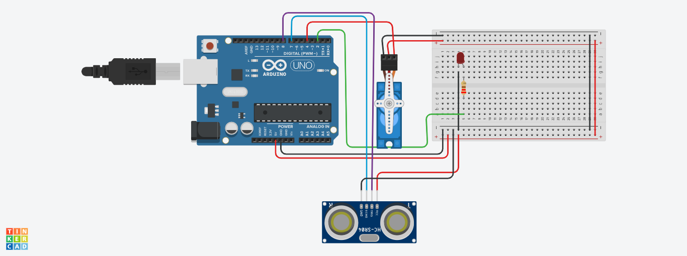

# Projeto Robô com Sensor de Proximidade
Este projeto foi desenvolvido dentro do Tinkercad, na disciplina de Internet das Coisas (IOT), para criação de um protótipo com 
arduíno que simula um robô que tem um sensor de proximidade que sempre que chegar próximo de algum objeto o sensor é ativado,
ascendendo um led e o robô gira a cabeça num ângulo de 90° para desviar do objeto.

## Componentes Usados
- 1 Arduíno uno
- 1 Protoboard
- 9 Jumpers m/m
- 4 Jumpers m/f
- 1 Ultrasonic Distance Sensor (4-pin)
- 1 Micro Servo
- 1 Led 3.3 v
- 1 Resistor 220 hms

## Montando o Circuito

## Explicação do Código

Inclusão da biblioteca que permite utilizar o servo motor
#include <Servo.h>

Criação das variáveis dos pinos que o led e o servo motor estão conectados, variável para calcular o tempo e a distãncia e a 
criação objeto para instaânciar o servo motor

int servo =4;
int led = 2;
long duracao;

Servo corpoServo;

Metodo para capturar a distância e definição da porta de entrada (trigger) e saína (echo) do sensor de proximidade, bem como 
os tempos de pausa entre as ações.

long distancia(int trigger, int echo){
  pinMode(trigger,OUTPUT);
  digitalWrite(trigger,LOW);
  delay(5);
  
  digitalWrite(trigger,HIGH);
  delay(10);
  digitalWrite(trigger,LOW);
  pinMode(echo,INPUT);
  
  return pulseIn(echo,HIGH);
}

Definição dos elementos de entrada e saída

void setup() {

  pinMode(led,OUTPUT);
  corpoServo.attach(servo);
  corpoServo.write(0);
}

Chama a função distancia( para medir a distância entre o sensor e o objeto. O valor retornado é multiplicado para converter
o tempo em centímetros, após identificar que a distância do sensor para o objeto é menor que 20 com ele aciona o led e após
uma pequena pausa de 1 segundo ele aciona o servo motor para girar em 90° e espera mais 1 segundo para dar tempo do servo 
motor completar o movimento.

void loop() {
 
int cm = 0.01723 * distancia(8,7); 

  if (cm < 20) {
    digitalWrite(led, HIGH);
    delay(1000);
    corpoServo.write(90); 
    delay(1000);
    
    
  } 
}
