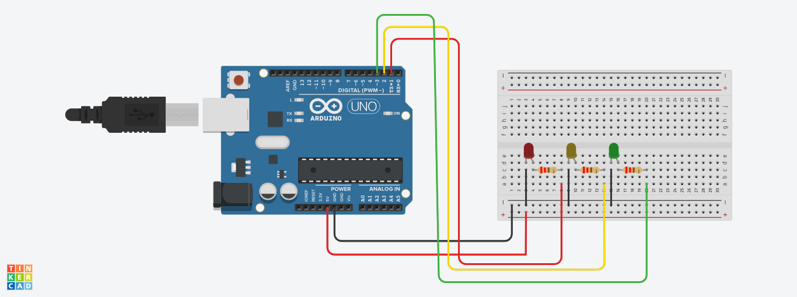

# Projeto Semáforo Simples

Este projeto foi desenvolvido dentro do Tinkercad, na disciplina de Internet das Coisas (IOT), para criação de um
protótipo com arduíno que simula o funcionamento de um semáforo simples.

## Componentes usados

- 1 Arduíno Uno
- 1 Protoboard
- 5 Jumpers m/m
- 3 leds de 3.3 v
- 3 resistor 220 hms

## Montando o circúito

## Explicação do Código
Criação das variáveis informando em qual porta cada led está conectado

int ledVermelho = 1;
int ledAmarelo = 2;
int ledVerde = 3;

Método define cada um dos leds como um dispositivo de saídade dados

void setup()
{
  pinMode(ledVermelho,OUTPUT);
  pinMode(ledAmarelo,OUTPUT);
  pinMode(ledVerde,OUTPUT);
}
Método define que quando o led vermelho acende, o verde e o amarelo permanecem pagados, com uma pausa de 5 segundos, o led amarelo liga
e o vermelho e o verde desligam, pausa de 5 segundos, o led verde liga e o vermelho e o amarelo permanecem desligados.
void loop()
{
  digitalWrite(ledVerde,LOW);
  digitalWrite(ledVermelho,HIGH);
  digitalWrite(ledAmarelo,LOW);
  delay(5000);
  
  digitalWrite(ledVermelho,LOW);
  digitalWrite(ledAmarelo,HIGH);
  digitalWrite(ledVerde,LOW);
  delay(5000);
  
  digitalWrite(ledVermelho,LOW);
  digitalWrite(ledAmarelo,LOW);
  digitalWrite(ledVerde,HIGH);
  delay(5000);
}
