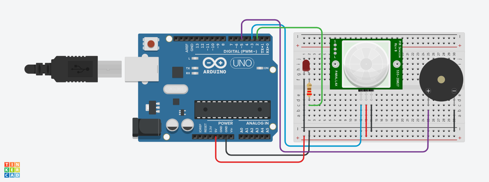

# Projeto Sensor de presneça com alarme sonoro
Este projeto foi desenvolvido dentro do Tinkercad, na disciplina de Internet das Coisas (IOT), para criação de um 
protótipo com arduíno que simula um sensor de presença que ao detectar movimento aciona um alarme sonoro e um led

## Componentes Usados

- 1 Arduíno Uno
- 1 Protoboard
- 9 Jumpers m/m
- 1 Piezo
- 1 Sensor PIR
- 1 led 3.3 v
- 1 Resistor 220 hms

## Montando o Circúito

## Explicação do Código

Criação das variáveis representam os pinos do Arduino aos quais esses componentes estão conectados.

int sensorPIR = 3;
int buzzer = 5;
int led = 2;

Esta função é executada apenas uma vez, quando o Arduino começa a rodar o código. Ela define os pinos
conectados aos componentes como saída (OUTPUT) ou entrada (INPUT).

void setup()
{
  pinMode(led,OUTPUT);
  pinMode(sensorPIR,INPUT);
  pinMode(buzzer,OUTPUT);
}

Esta função é executada continuamente e é onde ocorre a verificação de movimento,e monitora continuamente
um sensor de movimento PIR. Se o sensor detectar movimento, ele aciona um buzzer (fazendo-o emitir um som)
e acende um LED. Quando não há movimento, o buzzer para de emitir som e o LED se apaga.

void loop()
{
 int detectarPresenca = digitalRead(sensorPIR);
  if(detectarPresenca == 1){
    tone(buzzer,264);
    digitalWrite(led,HIGH);
    
  }else{
    noTone(buzzer);
    digitalWrite(led,LOW);
  }
}
