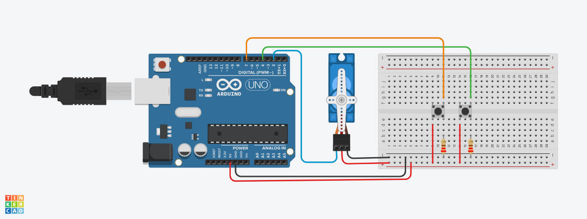

# Projeto Servo Motor
Este projeto foi desenvolvido dentro do Tinkercad, na disciplina de Internet das Coisas (IOT), para criação de um protótipo com 
arduíno que simula um motor que gira de 15 em 15 graus a cada vez que o botão é acionado e volta novamente a sua posição normal de 15
em 15 graus quando o outro botão é acionado.

## Componentes Usados

- 1 Arduíno Uno
- 1 Protoboard
- 9 Jumpers m/m
- 2 Botões
- 2 Resistores 220 hms
- 1 Micro Servo

## Montando o Circuito

## Explicação do Código

A biblioteca permite o controle de um servo motor, facilitando o envio de comandos de posicionamento para ele.
#include <Servo.h>

Criação do objeto para controlar o servo motor
Servo objetoservo;

Criação de variáveis para configurar os componentes com os pinos do Arduíno e criação da variável posicão que recebe
a posição inicial do servo

int servo = 2;
int botao = 4;
int botaovoltar = 7;
int posicao = 0;

Método inicializa o servo definindo ele inicialmente na posição 0 e define os botões como dispositivos de entrada
void setup()
{
 objetoservo.attach(servo);
 objetoservo.write(0);
 pinMode(botao,INPUT);
 pinMode(botaovoltar,INPUT);
 
}
Método contém duas condições: Na primeira Se precionar o botão o servo que está na posição 0, gira 15° em sentido horário
cada vez que o boitão é acionado, esperando 1 segundo para cada vez que o botão for acionado. Na segunda condição, que é 
acionada quando o botaovoltar é pressionado, o servo motor volta 15° da posição em que estava, esperando 1 segundo para
acionar o servo a cada vez que o botaovoltar for pressionado.
void loop()
{
  if(digitalRead(botao)==HIGH && posicao<180){
    posicao = posicao+15;
   	objetoservo.write(posicao);
    delay(1000);
  }
  if(digitalRead(botaovoltar)==HIGH && posicao>0){
    posicao = posicao-15;
   	objetoservo.write(posicao);
    delay(1000);
  }

