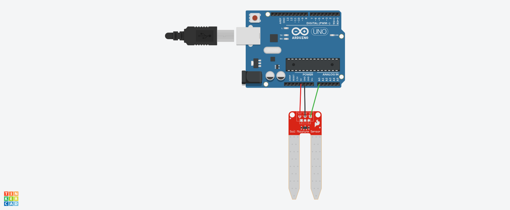

# Projeto Sensor de Umidade do solo
Este projeto foi desenvolvido dentro do Tinkercad, na disciplina de Internet das Coisas (IOT), para criação de um protótipo com
arduíno que simula um sensor que mede e classifica a umidade do solo em seco, ideal e úmido.

## Componentes Usados
- 1 Arduíno Uno
- 3 jumpers m/m
- 1 Sensor de Umidade do solo

## Explicando o Código

Criação da variável do sensor de umidade imdicando em qual o pino do arduíno ele está conectado
int sensor= A0;

Definindo o sensor como dispositivo de entrada e utilizando a função serial para imprimir os resultados das leituras no terminal

void setup()
{
  pinMode(sensor,INPUT);
  Serial.begin(9600);
  
}
Criação da variável para receber e guardar a umidade que foi capturada pelo sensor, depois define três condições que irá ser definida 
de acordo com a leitura do sensor para imprimir a mensagem para o usuário na tela do terminal

void loop()
{
 // Guardar o valor lido pelo sensor
  int umidade = analogRead(sensor);
  
  if(umidade>0 && umidade<=300){
    Serial.println("Solo Seco");
    delay(1000);
  }
  else if(umidade> 300 && umidade<=500){
    Serial.println("Solo ideal");
    delay(1000);
  }
  if(umidade> 500){
    Serial.println("Solo Umido");
    delay(1000);
  }
  
}
  
